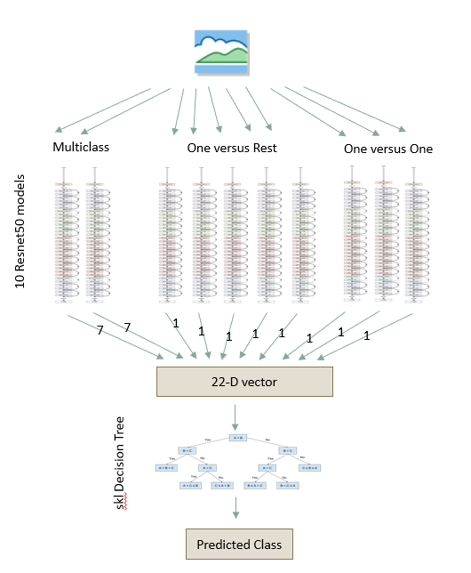
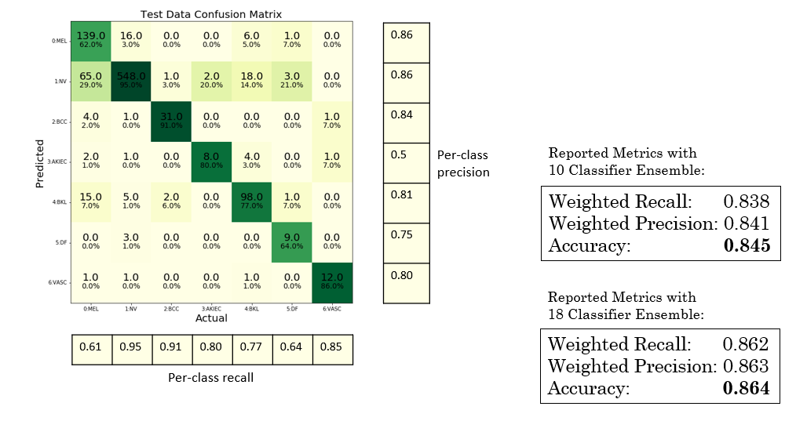
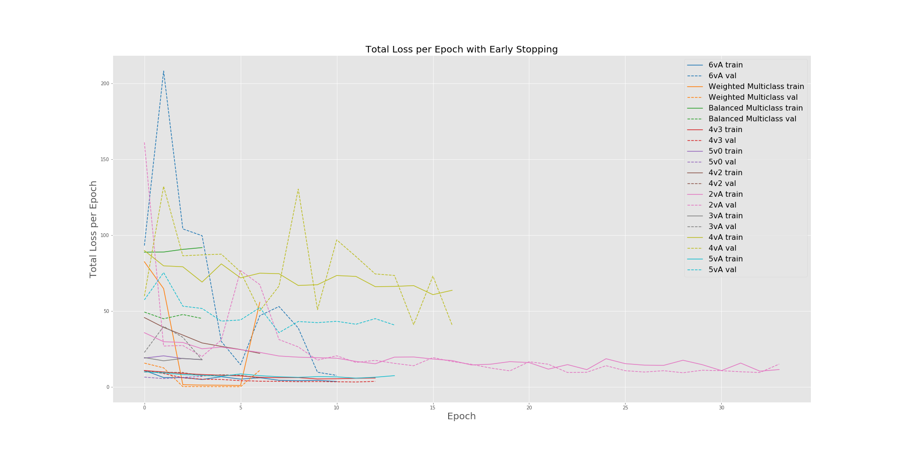

# Classification-ISIC-2018

A classic example of ensembling to the rescue! I first trained a multiclass classifier for classification of skin lesion images from the ISIC 2018 classification challenge, but this model didn't have great success (~65% accruacy) due in part to the severe class imbalance in the training data. To combat this, I trained an ensemble of multiclass, one-v-one, and one-v-rest classifiers as shown in the diagram below:

Using this strategy, the 10 classifier ensemble was able to acheive 84% accuracy on a test holdout set! By adding another 8 classifiers, I was able to push this even slightly higher to 86% accuracy. Inference for the 10-classifier ensemble takes about 13 seconds on a GTX 1080, so obviously this isn't a super fast solution, and wouldn't scale well to a task with more classes (say ImageNet classification). But for medical imaging, speed isn't critical so this approach works pretty well!

As evidence of the limite ability of individual classifiers to learn, the loss graphs shown below indicate that each single model isn't able to learn a super strong mapping from inputs to outputs.

