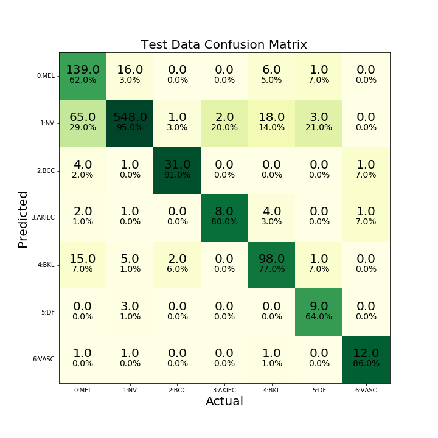

# Classification-ISIC-2018

Train an ensemble of classifiers for the ISIC-2018 skin lesion classification challenge. Note that you won't be able to run this code without the model checkpoints which are unfortunately too large to upload. But check out the awesome results in the form of the confusion matrix!

And here's the ugly looking loss graph from training each model:

